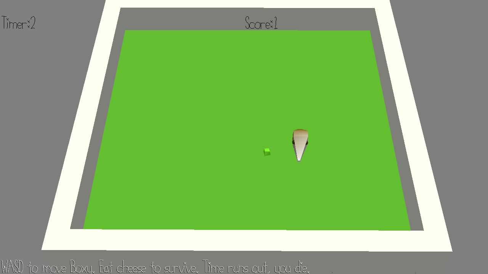

# Hungry Boxy with Sound

Author: Pavan Paravasthu

Design: Same game as game 2. Only changes are playing 2 BGM sounds parallely. One is a normal melody, the other uses dom 7 chords to provide a tense/morose feel on losing.

Screen Shot:

How To Play:

WASD movement. Eat the cheese to survive.

Sources: All music made with https://musiclab.chromeexperiments.com/Song-Maker/

This game was built with [NEST](NEST.md).

